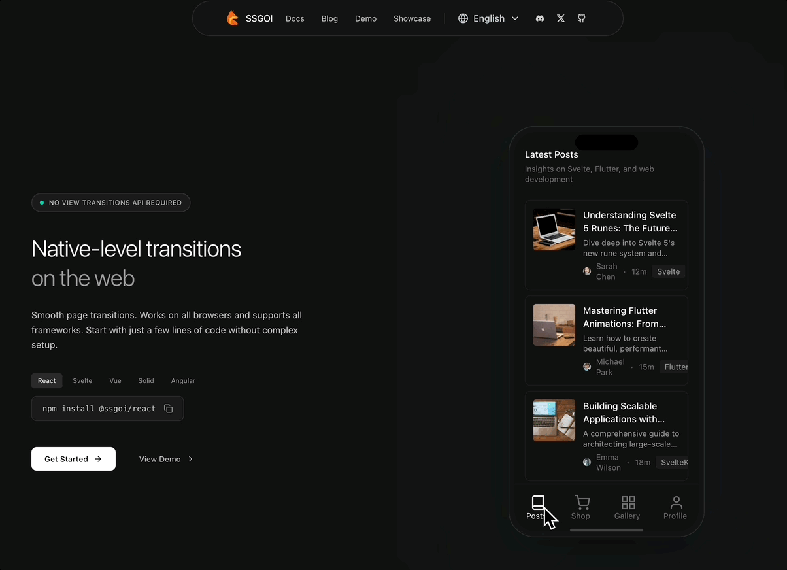

# SSGOI

Native app-like page transitions for the web.

**[Try it live →](https://ssgoi.dev)**



---

## AI-Assisted Setup

Using Claude, Cursor, ChatGPT, or other AI assistants? Let them set it up for you.

**Add this to your AI's context:**

```
https://ssgoi.dev/llms.txt
```

Contains complete setup guides, all transition types, troubleshooting, and API docs.

---

## Why SSGOI?

Web pages don't transition—they just swap. SSGOI changes that.

|                    | View Transition API | Other Libraries | SSGOI |
| ------------------ | :-----------------: | :-------------: | :---: |
| All browsers       |   ❌ Chrome only    |       ✅        |  ✅   |
| SSR support        |     ⚠️ Limited      |    ⚠️ Varies    |  ✅   |
| Spring physics     |         ❌          |     ⚠️ Some     |  ✅   |
| Router agnostic    |         ❌          |       ❌        |  ✅   |
| Back/forward state |         ❌          |       ❌        |  ✅   |

**60fps guaranteed** — Spring physics pre-computed to Web Animation API keyframes. GPU-accelerated, main thread free.

---

## Quick Start

```bash
npm install @ssgoi/react @ssgoi/core
```

### 1. Wrap your app (layout.tsx)

```tsx
"use client";

import { Ssgoi } from "@ssgoi/react";
import { drill } from "@ssgoi/react/view-transitions";

const config = {
  transitions: [
    { from: "*", to: "/post/*", transition: drill({ direction: "enter" }) },
    { from: "/post/*", to: "*", transition: drill({ direction: "exit" }) },
  ],
};

export default function RootLayout({ children }) {
  return (
    <html>
      <body>
        <Ssgoi config={config}>
          <div className="relative z-0">{children}</div>
        </Ssgoi>
      </body>
    </html>
  );
}
```

### 2. Mark your pages

```tsx
// app/page.tsx
export default function HomePage() {
  return (
    <main data-ssgoi-transition="/">
      <h1>Home</h1>
    </main>
  );
}

// app/post/[id]/page.tsx
export default function PostPage({ params }) {
  return (
    <main data-ssgoi-transition={`/post/${params.id}`}>
      <h1>Post Detail</h1>
    </main>
  );
}
```

**That's it.** Your pages now transition like a native app.

---

## Transitions

```tsx
import {
  drill,
  fade,
  scroll,
  slide,
  swap,
  sheet,
  hero,
  pinterest,
} from "@ssgoi/react/view-transitions";

drill({ direction: "enter" | "exit" }); // iOS-style (list → detail)
fade(); // Cross-fade
scroll({ direction: "up" | "down" }); // Vertical scroll
slide({ direction: "left" | "right" }); // Horizontal (tabs)
swap(); // Bottom tab navigation
sheet({ direction: "enter" | "exit" }); // Bottom sheet
hero(); // Shared element
pinterest(); // Gallery expand
```

See all transitions at [ssgoi.dev](https://ssgoi.dev/en/docs/mobile-transitions)

---

## Packages

| Package          | Framework         |
| ---------------- | ----------------- |
| `@ssgoi/react`   | React, Next.js    |
| `@ssgoi/svelte`  | Svelte, SvelteKit |
| `@ssgoi/angular` | Angular           |
| `@ssgoi/vue`     | Vue, Nuxt         |

---

## Documentation

**[ssgoi.dev](https://ssgoi.dev)** — Full docs, interactive examples, and API reference.

---

## License

MIT © [MeurSyphus](https://github.com/meursyphus)
