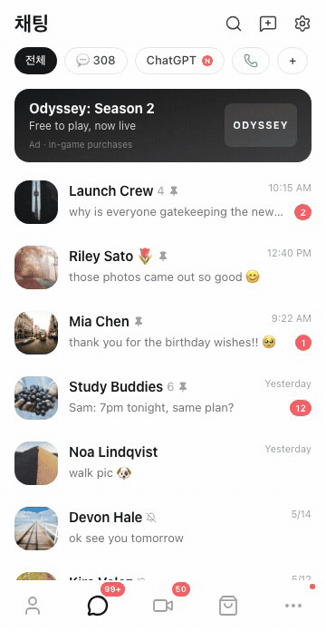
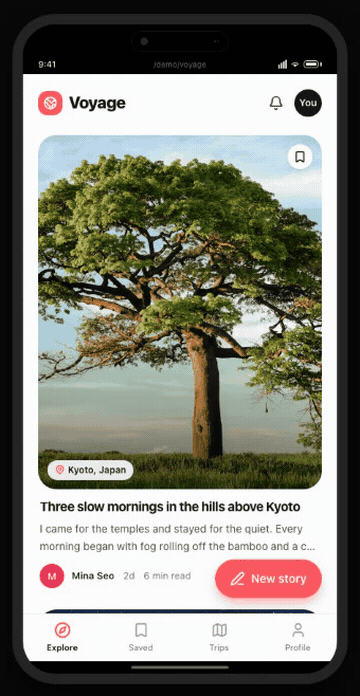
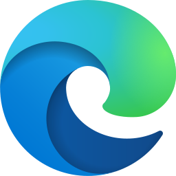
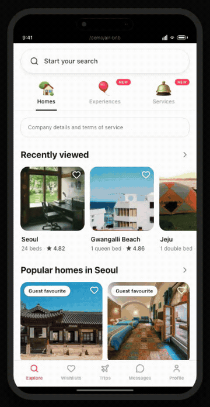
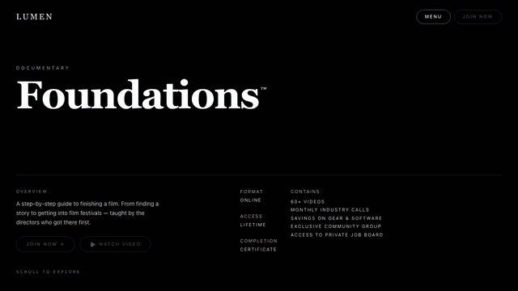

# SSGOI

Native app-like page transitions for mobile web apps.

**Router agnostic · Cross-browser · SSR ready · Web Animations API powered**

[Live showcase](https://ssgoi.dev) · [Documentation](https://ssgoi.dev/docs)

|                                                                   Drill                                                                    |                                                                    Sheet                                                                    |
| :----------------------------------------------------------------------------------------------------------------------------------------: | :-----------------------------------------------------------------------------------------------------------------------------------------: |
|  |  |
|                                  Navigate through a mobile app with spatial depth                                  |                                    Present focused tasks above the current page                                     |

## Why SSGOI?

| | |
| --- | --- |
| **Router agnostic** | Keep your existing router and let it own navigation. |
| **Cross-browser** | Use the same transitions across Chrome, Safari, Firefox, and Edge. |
| **Optimized motion** | Spring physics are precomputed into Web Animations API keyframes. |
| **Beyond the View Transition API** | Build transitions that need live DOM, runtime layers, and precise geometry. |
| **Easy to adopt** | Add SSGOI by changing only 2–3 files. |

---

## Set it up with one link

Give this URL to Claude, Codex, Cursor, or another coding agent:

```text
https://ssgoi.dev/llms.txt
```

It contains the full setup for React and Next.js, Svelte and SvelteKit, Vue and
Nuxt, Solid and SolidStart, Angular, and Qwik.

---

## Or install the agent plugin

The same `mobile-web-app` skill works in Codex and Claude Code.

Codex:

```bash
codex plugin marketplace add meursyphus/ssgoi
codex plugin add ssgoi@ssgoi
```

Claude Code:

```bash
claude plugin marketplace add meursyphus/ssgoi
claude plugin install ssgoi@ssgoi
```

Then ask the agent to apply SSGOI to the current mobile web app. The skill reads
the canonical `llms.txt`, selects the matching framework guide, and follows the
app's existing router and layout structure.

---

## Or add it in just 2–3 files

The React and Next.js setup is one config, one provider, and one simple
`usePathname()` boundary.

```bash
npm install @ssgoi/react
```

```tsx
// app/ssgoi-provider.tsx
"use client";

import { type ReactNode } from "react";
import { Ssgoi } from "@ssgoi/react";
import { drill } from "@ssgoi/react/view-transitions";

const config = {
  transitions: [{ on: "/**", except: "/", transition: drill() }],
};

export function SsgoiProvider({ children }: { children: ReactNode }) {
  return <Ssgoi config={config}>{children}</Ssgoi>;
}
```

Keep the route boundary separate so its ownership can evolve with the app:

```tsx
// app/ssgoi-route-boundary.tsx
"use client";

import { type ReactNode } from "react";
import { usePathname } from "next/navigation";

export function SsgoiRouteBoundary({ children }: { children: ReactNode }) {
  const pathname = usePathname();

  return (
    <div key={pathname} data-ssgoi-transition={pathname}>
      {children}
    </div>
  );
}
```

```tsx
// app/layout.tsx
import { type ReactNode } from "react";
import { SsgoiProvider } from "./ssgoi-provider";
import { SsgoiRouteBoundary } from "./ssgoi-route-boundary";

export default function RootLayout({ children }: { children: ReactNode }) {
  return (
    <html lang="en">
      <body>
        <main className="relative z-0 min-h-dvh overflow-x-clip">
          <SsgoiProvider>
            <SsgoiRouteBoundary>{children}</SsgoiRouteBoundary>
          </SsgoiProvider>
        </main>
      </body>
    </html>
  );
}
```

The class string above is Tailwind shorthand. Without Tailwind, apply
`position: relative; z-index: 0; min-height: 100vh; overflow-x: hidden` to the
shell; use `100dvh` and `overflow-x: clip` as progressive upgrades.

That is enough for a simple app. Other frameworks use the same small boundary
model with their own router state. For complete files, persistent layouts,
nested boundaries, and framework-specific setup, see the
[documentation](https://ssgoi.dev/docs/install).

---

## Compatibility

SSGOI depends on the broadly available Web Animations API instead of requiring
the View Transition API.

| <br />Chrome 84+ | <br />Safari 13.1+ | <br />Firefox 75+ | <br />Edge 84+ |
| :---------------------------------------------------------------------------------------: | :---------------------------------------------------------------------------------------: | :------------------------------------------------------------------------------------------: | :---------------------------------------------------------------------------------: |

These are core Web Animations API runtime targets. The blur types in Sheet and
Zoom also use `backdrop-filter` (Firefox 103+); earlier Firefox keeps the
transition, scale, and dimming but omits the backdrop blur.

It observes the DOM lifecycle your framework already owns, so routing and SSR
stay with your existing stack.

| <br />Next.js | <br />React Router | <br />TanStack Router | <br />SvelteKit | <br />Nuxt |
| :-----------------------------------------------------------------------------------: | :----------------------------------------------------------------------------------------------------: | :-----------------------------------------------------------------------------------------------------------------: | :-------------------------------------------------------------------------------------: | :-----------------------------------------------------------------------------: |

React · Svelte · Vue · Solid · Angular · Qwik · framework-agnostic core

[See complete compatibility and framework guides →](https://ssgoi.dev/docs/compatibility)

---

## Why SSGOI doesn't use the View Transition API

SSGOI owns the geometry, temporary visual layers, live outgoing DOM, and
navigation policy needed to turn complex motion into reusable presets.

|                                                                      Zoom                                                                       |                                                              Film                                                               |                                                                    Sheet                                                                    |
| :---------------------------------------------------------------------------------------------------------------------------------------------: | :-----------------------------------------------------------------------------------------------------------------------------: | :-----------------------------------------------------------------------------------------------------------------------------------------: |
|  |  |  |
|                   The whole detail page unfolds from its image                    |                           Runtime scene, live video, and multiple springs                           |                         A live backdrop sits between the two pages                          |

[Read why SSGOI doesn't use the View Transition API →](https://ssgoi.dev/blog/view-transition-api-limitations)

---

## License

[MIT Licensed](./LICENSE) © [MeurSyphus](https://github.com/meursyphus)
