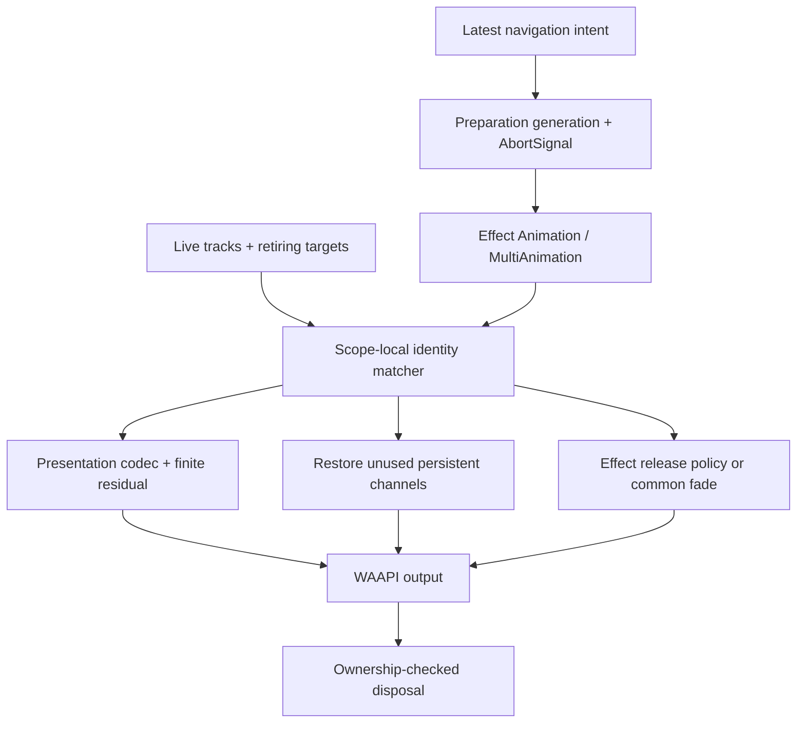

# Interrupted transitions: a shared handoff contract

Draft implementation for [RFC #409](https://github.com/meursyphus/ssgoi/issues/409), based on `latest` at `3b7d612`. This branch changes the web engine and built-in effects; the native renderer is **not** migrated. The portable matcher and residual math are exported through `@ssgoi/core/runtime` for a later native adapter.

## Why this is an engine change

In `A → B / drill`, then `B → C / zoom`, A can still be visible, B changes roles while moving, and C introduces new targets. Replacing a single composite slot is insufficient. Copying `progress = 0.4` between two unrelated style functions is also insufficient: progress is an authored parameter, not a common position or velocity.

The former host sampled scalar poses, force-completed the old composite (including cleanup), and sent poses to `MultiAnimation.matchInto()`, which did nothing. Old cleanup could reset new styles; a delayed prepare could attach after newer navigation; blind cleanup belonged to one panel rather than the whole effect.

This implementation keeps three responsibilities separate:

- **Identity:** which visual target persists, and which renderer now presents it?
- **Presentation:** how does the current output connect to a newly authored path?
- **Presence and execution:** which stages are invalid, which resources remain visible, and when can their owner dispose them?



## What other engines actually contribute

These are source observations, not benchmarks or claims about every release. Sources are pinned to the snapshots inspected for the RFC and checked again during implementation.

| System                                                                                                                                                                                                             | Observed mechanism                                                                                                                                                                       | Decision here                                                                                                                                                |
| ------------------------------------------------------------------------------------------------------------------------------------------------------------------------------------------------------------------ | ---------------------------------------------------------------------------------------------------------------------------------------------------------------------------------------- | ------------------------------------------------------------------------------------------------------------------------------------------------------------ |
| [Flutter Hero](https://github.com/flutter/flutter/blob/9584c6713b324636289d067944a46fd6b49df14b/packages/flutter/lib/src/widgets/heroes.dart#L741)                                                                 | `divert()` distinguishes reversed push/pop from redirection; the general case starts a new rect tween at the currently evaluated rect. The flight owns overlay and placeholder lifetime. | Match semantic media keys across renderers; separate target lifetime from execution. Do not claim Flutter supplies arbitrary cross-effect velocity matching. |
| [Flutter routes](https://github.com/flutter/flutter/blob/9584c6713b324636289d067944a46fd6b49df14b/packages/flutter/lib/src/widgets/routes.dart#L434)                                                               | Secondary animations can use train hopping; an incoming route can delegate the outgoing behavior of its predecessor.                                                                     | Effects describe their own companion behavior; no table of every possible effect pair.                                                                       |
| [Compose Animatable](https://github.com/androidx/androidx/blob/e8cac06846dd0164454bd44b77ed1c4e95ec7591/compose/animation/animation-core/src/commonMain/kotlin/androidx/compose/animation/core/Animatable.kt#L227) | A replacement uses the current value and default velocity; cancellation ends the old coroutine and its subsequent work.                                                                  | Invalidate execution and pending stages while retaining presentation. “Cancel” must not imply “seek to the old endpoint.”                                    |
| [Motion layout projection](https://github.com/motiondivision/motion/blob/372846e89d05cf7e12d1122bdf277c20afb11d5c/packages/motion-dom/src/projection/node/create-projection-node.ts#L1743)                         | Layout projection starts its new progress animation with `velocity: 0`, despite property MotionValues having velocity handoff.                                                           | State explicitly which representation preserves velocity; do not generalize from scalar progress.                                                            |
| [Reanimated 4.6.0](https://github.com/software-mansion/react-native-reanimated/blob/8651062064b518dac61bed9740110a645d65e757/packages/react-native-reanimated/src/animation/spring/spring.ts#L159)                 | The inspected spring start transfers previous velocity, then clips velocity pointing away from the new target.                                                                           | Keep away-from-target inertia in our supported continuation path. That clipping is a valid product policy, but a different one.                              |
| [Motion Matching inertialization](https://github.com/orangeduck/Motion-Matching/blob/57b7250e0d34a4e456a34d47e24c2f05fdcc711e/spring.h#L162)                                                                       | Persistent offsets bridge a new destination and decay while evaluating its motion.                                                                                                       | Bridge the final presentation, including previous corrections. We use a finite Hermite residual, not a port of the reference spring implementation.          |

Some systems deliberately cancel and replace execution. Others overlap content, transfer numeric state, redirect a flight, or wait. Cancellation itself is not the defect: losing the presentation state or allowing obsolete work to run is the defect.

## Interfaces and ownership

`WebAnimationOptions.motion` is the opt-in metadata surface for effect authors:

```ts
new WebAnimation({
  element: flight,
  integrator: new SpringIntegrator({ stiffness: 170, damping: 24 }),
  style: (t, u) => authoredFlight(t, u),
  motion: {
    key: photoId,
    role: "shared-media",
    space: overlayRoot,
    lifetime: "temporary",
    handoffDuration: 280,
    release: "fade", // "remove" or (snapshot) => WebAnimation
    fallback: "crossfade", // or explicit "finish"
    // codec: customPresentationCodec,
  },
  onDispose: ({ owns }) => {
    if (owns(flight)) flight.remove();
  },
});
```

Ordinary page tracks require no semantic key. Their real DOM identity persists across an enter/out role change. `label` is an editing label, not a semantic identity. A route pathname is not assumed to identify a retained route entry.

A match is one-to-one inside one Host. Exact target identity is preferred; otherwise an explicit key requires the same semantic role and coordinate-space token. Conflicting explicit keys, duplicate sources or destinations, and unrelated spaces are not silently resolved by array order. Built-in Hero uses the photo key and overlay root. Blind keys include direction and panel count, with the owning page as space; incompatible panel layouts enter/release rather than matching by index alone.

A codec reads style into named numeric channels and writes them back. Each channel declares a schema, value vector, and velocity vector in matching units. A custom codec must provide compatible coordinates across instances, finite numbers, and round-trippable values. Matching an ID never overrides a schema mismatch.

Custom web wrappers expose their participating drivers with `getMotionTracks()`; the host does not identify named effect classes. Executions should be fresh per plan, while the Host owns continuity across plans.

`onComplete` means the authored goal settled. `onDispose` means the execution's resources can be released; it receives `finished`, `interrupted`, or `disposed` and an `owns(element)` predicate. Effect cleanup touching several elements must check each independently. Built-in composite cleanup is deferred until all child motion settles, including restoration tracks. `stop()` invalidates execution without disposal; `cancel()` stops without writing an endpoint, then disposes with ownership checks.

The host retains obsolete resources only during their release motion. A new request can reclaim an older retiring page. Retiring runs are bounded at eight; older runs are disposed under resource pressure. This cap is an intentional safety boundary, not an unlimited continuity guarantee.

## Presentation and timing

The default web codec represents an element's projected plane in viewport coordinates, acting on a normalized unit box. Translation, rotation, scale, shear, and planar perspective are separate components. It converts percentage translation and different transform origins/box sizes into this representation. Rotation is unwrapped before differentiation. Other numeric CSS values use an exact-template schema.

The handoff is:

```text
initial offset   = current output - new authored path at handoff
initial velocity = current output velocity - new authored path velocity
output(t)        = new authored path(t) + residual(t)
```

The cubic residual matches value and derivative at zero and reaches exactly zero value and derivative at its finite horizon (280 ms by default). If the authored path is shorter, playback is extended to finish the correction. Repeated interruptions sample the corrected output, rather than stacking an ever-growing history. WAAPI remains the renderer; this does not introduce a perpetual JavaScript DOM-write loop.

The math is C1 at the handoff in supported numeric coordinates. WAAPI plays sampled frames, so visible derivative accuracy is limited by sampling, CSS interpolation/clamping, startup pacing, and device presentation. The browser matrix checks geometry at handoff; it is not a proof of exact perceptual velocity for every effect or frame.

Reversing the same `WebAnimation` also preserves the compatible integrator's internal state. This includes the double spring's leader, not only its follower's visible value. Different effects use presentation bridging instead of sharing incompatible solver internals. The normal authored integrator is retained.

A new navigation owns its authored direction; an earlier playback `reverse()` does not reverse the next unrelated plan. A new plan owns its own dependency graph. A transferred delayed child holds its adopted pose until its new dependency starts it. Pausing/resuming does not replay completed predecessors. Reversing an unfinished sequence reverses active stages immediately and does not invent unstarted stages; completed stages use reversed dependencies. First crossing and actual settling remain distinct conditions.

## Fallback is part of the contract

| Condition                                                                                              | Behavior                                                                                                                               |
| ------------------------------------------------------------------------------------------------------ | -------------------------------------------------------------------------------------------------------------------------------------- |
| No matching entity, changed semantic key, duplicate key, or changed blind topology                     | Enter the new target; release the old target independently. Ambiguity is observable.                                                   |
| Persistent target remains but its old track is absent                                                  | Add a restoration track instead of removing the target. Temporary panels are excluded from this rule.                                  |
| Compatible numeric presentation                                                                        | Bridge the current output and velocity.                                                                                                |
| Incompatible/opaque CSS on a match                                                                     | Crossfade an inert, noninteractive frozen DOM copy when a valid frame can be captured. A custom effect can choose `finish` explicitly. |
| Canvas, live video/audio, iframe/embed/object, shadow-root target, or unavailable frame                | Finish fallback; do not duplicate live content and pretend it is a faithful snapshot.                                                  |
| Transformed/perspective ancestor                                                                       | The default viewport codec declines transform matching. Supply a coordinate-aware codec or use finish fallback.                        |
| Invalid effect-specific release factory                                                                | Report the failure and use the common fade.                                                                                            |
| Opaque custom `Animation` driver or a legacy `WebAnimation` constructor with only `onComplete` cleanup | Legacy completion fallback, with incoming target styles protected. Implement the interruption/disposal contract for stronger behavior. |
| Rejected, stale, or disconnected preparation                                                           | Abort its signal, release registered resources, restore owned pages, and prevent late attachment.                                      |

`HostAnimation.onHandoff` reports matches, ambiguity, releases, fallback properties and the selected CSS fallback mode. `getTimeline()` exposes the actual corrected keyframe styles.

Preparation gets `signal` and `onCleanup`. Custom asynchronous preparation must check `signal.aborted` after external awaits. JavaScript cannot retract arbitrary side effects already performed by an uncooperative callback. Built-ins register prepare-created blind containers and film borders so rejection/supersession also cleans them.

## Validation and remaining review

The fixture is `packages/core/tests/browser/motion-continuity.html`. To run a frozen bundle without hot-reload changing a test in progress:

```sh
node scripts/prepare-motion-continuity.mjs
# Serve the returned directory with a local HTTP server, then open index.html.
# Run window.continuityLab.runMatrix() in the browser console.
```

The 19 cases cover every built-in effect and selected variants, including vertical blind with a different count, blurred/expanded zoom, film, and strip perspective. The 19 × 19 matrix measures the outgoing B page before and after A→B is interrupted by B→C, checks finite styles, and records handoff events. It does not claim exhaustive visual validation of every shared descendant, arbitrary DOM nesting, scroll offset, or mobile compositor.

Recorded validation: 234 core tests, core build/lint, all eight package builds, 361/361 Chromium geometry combinations (under 1 px), and 6/6 cleanup/fallback browser scenarios. See [the frozen-bundle result record](./05-motion-continuity.validation.json). An additional 12-navigation Activity browser probe ended with only the latest page visible and zero WAAPI/retiring executions.

Additional tests cover scoped/ambiguous identities; residual endpoint and velocity conditions; incompatible CSS; opposite style mappings; shared media across renderers; cancellation callback suppression; reclaiming older retirees; sequence reversal/resumption; double-spring state; stale/rejected prepares and ownership. Browser scenario checks include repeated Activity navigation, fallback-copy disposal, and shared/temporary-resource cleanup.

Review before graduating this draft:

- Arbitrary asynchronous prepare callbacks that mutate live layout before they become ready can expose intermediate preparation states; cooperative cancellation prevents stale commits, not every externally authored DOM mutation.
- Negative WAAPI playback rates and changing rate during a residual need separate perceptual validation; navigation reversal uses a new resolved plan or `reverse()`.
- Physical iOS Safari/WebKit testing, including body scroll, paint timing and startup pauses.
- Variable layout during a run, nested transformed ancestors and nonplanar 3D content need stronger/custom coordinate contracts.
- Numeric-template CSS is deliberately narrower than a universal CSS interpolation engine; clipping discontinuities and unsupported representations can use fallback.
- DOM fallback copies do not preserve arbitrary application state. The real view remains the interaction owner.
- The first implementation chooses replacement plus residual correction, not arbitrary additive track mixing on the same property.
- Opaque custom drivers and custom effects using completion callbacks for cleanup require migration to `onDispose`. Constructor-based legacy WebAnimation cleanup takes the finish fallback; arbitrary later callback assignments cannot be inferred as cleanup automatically. Native presence/playback integration remains separate work.

No package version or release is part of this draft.

## Rebase and review revisions

Rebased onto `latest` after 7.2.0 (`cb48248`). Two features landed there in the meantime and were merged with this contract rather than replaced:

- **Scroll lock lifetime (#418).** A run still acquires its container lock before superseding a pending predecessor. It is released exactly once by whichever path ends the run: disposal (finished or retired), supersession before attach, failure, or the 5 s abandoned-prepare bound. Retired runs therefore keep their lock until their release motion is disposed, while the newer run already holds its own.
- **In-place hero (#415, #416).** The real destination image stays the persistent track and carries the photo key with role `shared-media`; source copies are unkeyed (`shared-media-source`), so a redirected navigation transfers the flight to the new destination node and never matches a copy. Layout restoration (`fitHeroImage`, CSS hooks) runs regardless of ownership: a newer track on the same image only drives transform/clip/opacity, and opacity is arbitrated by the existing lease.

Review changes to the draft itself:

- **Presentation decoding is lazy.** An uninterrupted run no longer measures the element, walks its ancestors or decodes every authored frame through the codec; it plays plain authored keyframes. The codec is consulted when a snapshot is taken (two frames around the current time) or when an adopted presentation is bridged into new keyframes.
- **Restoration does not take ownership.** A restoration track only returns transform/opacity toward rest, so the previous effect keeps ownership of that target and its cleanup still clears everything else it wrote (`will-change`, `contain`, clip, stacking). Restoration is only created when the snapshot has a transform or opacity channel; other channels are returned by the previous effect's cleanup. A restoration clears the resting frame it wrote inline where nothing was set before.
- **Descendants of a surviving page are never released on their own.** They belong to their page; releasing them would fade content of a page that is still visible.
- **A persistent source whose flight moved to another node is hidden** (via the shared opacity lease) until the run that carries its identity is disposed, so the in-page image does not show at rest beside its own flight.
- **Ownership is stamped before supersession.** A run claims its pages before the superseded preparation restores its own, so a page that is about to animate out again is not hidden by the older run's cleanup.
- **No startup barrier at the handoff.** `WebAnimation` no longer waits for `ready` plus two animation frames before its first seek; the paused 0 ms frame renders in the frame the run is created, the frame-paced clock seeks from the next frame on (clearing inline start styles in that same rendering update), and the clock is handed to WAAPI by assigning `startTime` instead of `play()`, which resolved a frame late. A moving element therefore never freezes at a handoff (previously 3 frozen frames followed by a double step), and every transition start is three frames earlier. Stall protection is unchanged: the frame-paced clock still clamps a long frame to 33 ms until two stable frames have passed.

**Follow-up after merge (2026-09-25, `refactor/native-waapi-startup`): the frame-paced startup clock is gone.** `WebAnimation` now leaves `element.animate()` playing natively and only seeks the pending run one nominal frame in, so a handoff does not repeat the frame already on screen; inline start styles are cleared at once because the effect applies while the start time is pending. Headless Chromium measurements behind the change: a 150 ms main-thread stall in the task that creates the run is not charged either way, because a pending start time resolves at the first rendering update after the stall (native `ct` 0 → 16.7; the old clock had charged 50 ms by then). A stall after the first painted frame was never caught by the old clock in Chromium: the first rendering update after a long task carries the pre-stall frame time (a missed BeginFrame), the clock read it as a stable frame and handed off by `startTime`, and the next update jumped to 166.7 ms — identical to native. Handoff traces show no frozen or doubled frame in either version. Startup no longer depends on `requestAnimationFrame` firing, so a run created in a throttled (hidden) document is no longer stuck at 0 ms, and compositor playback begins with the first frame. `FrameScheduler` remains only as the shared poll for `MultiAnimation` start conditions.

Known limits kept from the draft: a channel with no known base (clip, filter, color) on a persistent descendant pops to the previous effect's resting value at handoff; `prepareHandoff()` pauses the running transition for the duration of the next `prepare`, so a slow asynchronous prepare shows a stall rather than stale measurements.
